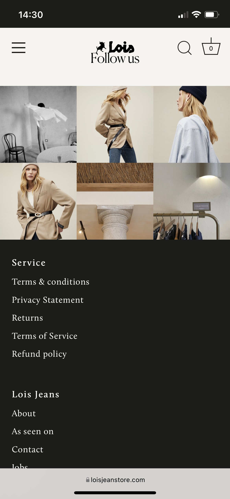

# Procesverslag
Markdown is een simpele manier om HTML te schrijven.  
Markdown cheat cheet: [Hulp bij het schrijven van Markdown](https://github.com/adam-p/markdown-here/wiki/Markdown-Cheatsheet).

Nb. De standaardstructuur en de spartaanse opmaak van de README.md zijn helemaal prima. Het gaat om de inhoud van je procesverslag. Besteedt de tijd voor pracht en praal aan je website.

Nb. Door *open* toe te voegen aan een *details* element kun je deze standaard open zetten. Fijn om dat steeds voor de relevante stuk(ken) te doen.

## Jij

Uitwerken voor kick-off werkgroep

### Auteur:
Kiki Nova de Ruig

#### Je startniveau:
Piste Rood

#### Je focus:
Responsive (Wanneer er gemerkt wordt dat dit lukt wil ik graag beide aanpakken.)
 

## Je website

Uitwerken voor kick-off werkgroep

### Je opdracht:
Lois Jeans:
https://loisjeanstore.com/

#### Screenshot(s) van de eerste pagina (small screen): 
Homepage - Lois Jeans 
  

#### Screenshot(s) van de tweede pagina (small screen):
Women Productpage - See all - Lois Jeans  
  

 

## Breakdownschets (week 1)

Uitwerken na afloop 2e werkgroep

### De hele pagina: 

### Dynamisch deel (bijv menu): 

### Wellicht nog een dynamisch deel (bijv filter): 

## Voortgang 1 (week 2)

Uitwerken voor 1e voortgang

### Stand van zaken
Ik ben lang bezig geweest met het uitvogelen van hoe ik de website het beste stuctuur kan brengen. 
Met verschillende kleurvlakken probeer ik de website zo goed mogelijk vorm te geven. Helaas heb ik hier nog veel moeite mee. 

### Verslag van meeting
hier na afloop snel de uitkomsten van de meeting vastleggen

- Probeer een begin te maken met de tweede pagina 
- Probeer de homepage nu echt af te ronden. 

## Voortgang 2 (week 3)

Uitwerken voor 2e voortgang

### Stand van zaken
Bij dit voortgang gesprek was ik helaas niet aanwezig vanwege mijn migraine en koorts. 

### Verslag van meeting
hier na afloop snel de uitkomsten van de meeting vastleggen

N.v.t.

## Toegankelijkheidstest (week 4)

Uitwerken na test in 8e voortgang

### Bevindingen
Lijst met je bevindingen die in de test naar voren kwamen:

#### Screenreader
Tijdens de les van donderdag 9 december hebben wij verschillende testen gedaan. De screenreader was hier 1 van. 
De website links worden goed opgelezen. En de headings ook. De website zou dus te volgen zijn als je blind/slecht zient bent. 

#### Muis en toetsenboard. 
Ook met de tabs en het toetsenboard kan je door de website geleid worden. Ondanks dat de website nog geoptimaliseert moet worden. 
Hier kan dus alleen nog maar verbetering in komen.

#### Schrokaparaat.
Dit was vooral een beleving voor mijzelf. De knoppen waren groot genoeg om op te kunnen klikken. Alleen het blijft lastig met deze aandoening om uberhaupt goed gebruik te maken van een toetsenboard of muis. 

## Voortgang 3 (week 4)

Uitwerken voor 3e voortgang

### Stand van zaken
Het is gelukt om een slider te plaatsen in mijn website. Helaas klopt er iets niet, waardoor de site buiten de marges valt. 
Dit kost teveel tijd om momenteel op te lossen. Daarom heb ik besloten deze weg te halen en te kiezen voor eens standaar vaste header.
Helaas, ik heb het geprobeert. Door dat er verschillende sections gebruikt werden in deze banner heb ik ervoor gekozen de site opnieuw over te schrijven. 
In een nieuw document zodat de CSS van de andere onderdelen van de website weer kloppen. Het is namelijk een te grote puzzel om de slider weg te halen en de rest kloppend te krijgen. Hierbij kan ik ook beter gaan opletten naar de website responsive maken. 

### Verslag van meeting

 N.v.t.

## Eindgesprek (week 5)

Uitwerken voor eindgesprek

### Stand van zaken
Ik had veel moeite met het coderen van de Lois Jeans website. De onderdelen van de website had ik soms wat onderschat.
Vooral dit onderdeel:

Daarnaast heb ik geleerd om te gaan met Media queries.

 
### Screenshot(s)

Het eindresultaat:

 

## Bronnenlijst

Continu bijhouden terwijl je werkt

Nb. Wees specifiek ('css-tricks' als bron is bijv. niet specifiek genoeg).

1. https://developer.mozilla.org/en-US/docs/Web/CSS/Media_Queries/Using_media_queries

